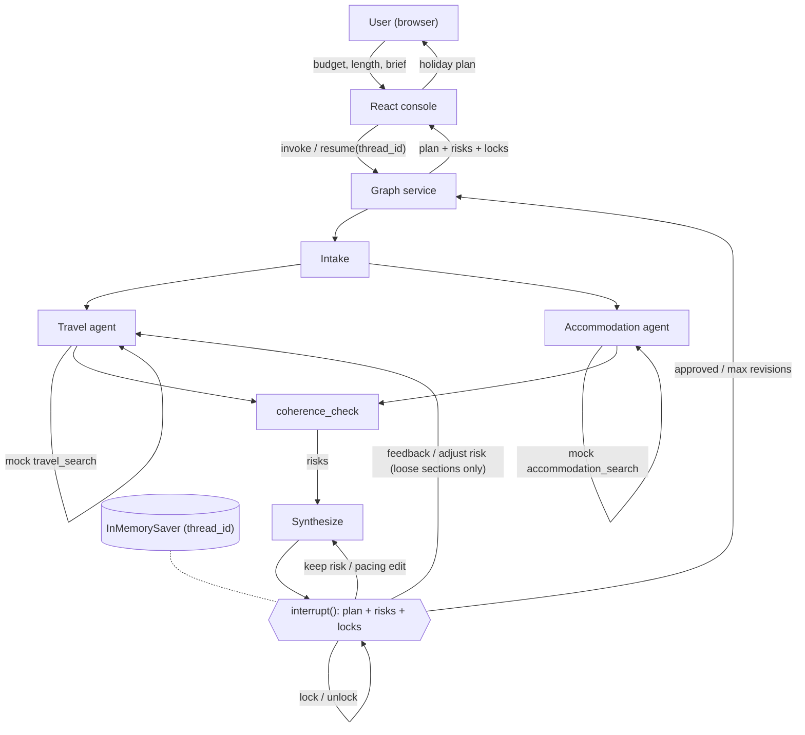

# Travel Agent Assistant — POC Plan

> **Status:** Draft
> **Owner:** swrobertson0@gmail.com
> **Last updated:** 2026-09-06
>
> This document is the **source of truth** for the POC. Code is written to satisfy this
> spec; when reality diverges, update this doc first, then the code. Requirements are
> numbered (R1, R2, …) so commits, tests, and PRs can reference them.

---

## 1. Overview / Problem Statement

_What does this POC prove, and why now? 3–5 sentences. State the core hypothesis in one
line: "We believe that **X** for **Y** will result in **Z**."_

TODO

---

## 2. Goals & Non-Goals

### Goals

- G1 — TODO
- G2 — TODO

### Non-Goals (explicitly out of scope for the POC)

- N1 — TODO
- N2 — TODO

---

## 3. Success Criteria

_How we know the POC worked. Prefer demoable or measurable outcomes over vibes._

- S1 — TODO (e.g. "A user can ask _<scenario>_ and receive _<result>_ in under N seconds")
- S2 — TODO
- S3 — TODO

---

## 4. Users & Use Cases

**Primary user:** TODO

| # | Scenario | Input | Expected outcome |
|---|----------|-------|------------------|
| UC1 | TODO | TODO | TODO |
| UC2 | TODO | TODO | TODO |

---

## 5. Requirements

### Functional

- **R1** — TODO
- **R2** — TODO
- **R3** — TODO

### Non-Functional

- **R10** — Latency: TODO
- **R11** — Cost ceiling per run: TODO
- **R12** — Reproducibility: TODO
- **R13** — Secrets handling: TODO

---

## 6. Architecture Overview

_Components, data flow, and external dependencies. One diagram._



The interface is the **React console** (`travel-agent-console/`), not a terminal. The
backend is a LangGraph `StateGraph` exposed as a **graph service** that the console
`invoke`s and `resume`s. A LangGraph `StateGraph` acts as the orchestrator from the Goal 1
diagram: one graph run is one holiday-planning session, identified by a `thread_id` and
persisted by an in-memory checkpointer so the `review` step can suspend and resume across
HTTP calls. (A small script to drive one run without the browser is a dev-only test
harness, not the product interface. The service shape — LangGraph dev server vs. a thin
FastAPI wrapper — is left to fall out of building it; see §8.)

Flow:

1. **Intake** parses the user's `budget`, trip `length`, and free-text `brief` from the
   opening message into graph state.
2. The orchestrator **fans out in parallel** to two specialist nodes — **Travel** and
   **Accommodation** — each backed by a LangChain `create_agent` agent whose only tool
   returns **mock fixture data** (no external network calls in the POC).
3. **Coherence check** runs after any specialist re-run: it flags — as `risks`, never by
   editing another section — where one change has left another section's pick incoherent.
4. **Synthesize** merges both specialists' output into a single holiday plan (day-by-day
   outline, chosen travel + lodging, total cost vs budget, open risks inline, any gaps).
5. **Review** calls `interrupt()` to surface the plan, its risks, and the section lock
   state **to the console**. The user can approve, give feedback, lock/unlock a section, or
   resolve a risk (**adjust** vs **keep as-is**). Locked sections are never re-dispatched or
   auto-changed. Bounded by a maximum revision count. See §7.6 for the full model.

External dependencies: `langgraph`, `langchain`, `langchain-anthropic`, and the Anthropic
API (`ANTHROPIC_API_KEY`). No travel or hotel APIs are used — fixtures only.

---

## 7. LangGraph Design

### 7.1 State Schema

_The graph state object and every field it carries. This is the contract between nodes._

| Field | Type | Written by | Read by | Notes |
|-------|------|-----------|---------|-------|
| `messages` | `Annotated[list, add_messages]` | all | all | conversation history |
| `budget` | `int` (unit decided in impl) | `intake` | specialists, `synthesize` | hard ceiling for the plan |
| `trip_length_days` | `int` | `intake` | specialists, `synthesize` | trip duration |
| `brief` | `str` | `intake` | specialists, `synthesize` | raw free-text prompt from the user |
| `specialist_results` | `Annotated[list[dict], operator.add]` | `travel_agent`, `accommodation_agent` | `synthesize` | reducer required — the two nodes write concurrently; each dict is `{"domain": ..., "options": [...], "notes": ...}` |
| `draft_plan` | `str` | `synthesize` | `review`, CLI | current proposed plan (itinerary + cost breakdown vs budget) |
| `feedback` | `str \| None` | `review` | `synthesize` | latest user feedback; overwrites (no reducer) |
| `approved` | `bool` | `review` | router | `True` once the user accepts the plan |
| `revision_count` | `Annotated[int, operator.add]` | `review` | router | increments each review; caps the loop |
| `section_locks` | `dict[str, bool]` — keys `"travel"`, `"accommodation"` | `review` | router, `coherence_check`, specialists | a **locked** section is one the user has committed to; it is never re-dispatched or auto-changed. Default all `False` |
| `risks` | `list[dict]` (no reducer — one writer at a time) | `coherence_check`, `review` | `synthesize`, `review`, CLI | cross-section coherence conflicts. Each: `{"id", "concerns": "travel" \| "accommodation", "title", "detail", "status": "open" \| "accepted" \| "resolved"}` |

### 7.2 Nodes

| Node | Responsibility | Inputs (state) | Outputs (state) |
|------|----------------|----------------|-----------------|
| `intake` | Parse `budget`, `trip_length_days`, and `brief` from the opening user message (structured-output LLM call). | `messages` | `budget`, `trip_length_days`, `brief` |
| `travel_agent` | `create_agent` with the `travel_search` mock tool; returns transport options that fit the dates and budget, honoring any `feedback`. **Runs only when the `travel` section is loose** (or the user explicitly changed it — see §7.6). | `budget`, `trip_length_days`, `brief`, `feedback`, `section_locks` | `specialist_results` (append `{"domain": "travel", ...}`) |
| `accommodation_agent` | `create_agent` with the `accommodation_search` mock tool; returns lodging options within budget for the dates. **Runs only when the `accommodation` section is loose.** | `budget`, `trip_length_days`, `brief`, `feedback`, `section_locks` | `specialist_results` (append `{"domain": "accommodation", ...}`) |
| `coherence_check` | LLM node. After a specialist re-runs on feedback, check whether that change leaves any **other** section's current pick incoherent (wrong city, impossible transfer, blown budget, dates that no longer line up). Emit one `risk` per conflict. **Never edits another section** — it only annotates. No-op on the initial fan-out. | `specialist_results`, `section_locks`, `brief`, `budget` | `risks` |
| `synthesize` | LLM node. Merge `specialist_results` + `brief` (+ `feedback` on revisions) into one holiday plan: day-by-day outline, selected travel + lodging, total cost vs `budget`, open `risks` called out inline, and any gaps (e.g. empty fixture results). | `specialist_results`, `brief`, `budget`, `feedback`, `risks` | `draft_plan` |
| `review` | `interrupt({"plan": draft_plan, "risks": risks, "section_locks": section_locks})` to surface the plan to the console. The resume payload is one of: an approval; feedback text; a lock/unlock on a section; or a decision on an open risk (`adjust` / `keep`). | `draft_plan` | `approved`, `feedback`, `revision_count` (+1), `section_locks`, `risks` (status updates) |

### 7.3 Edges & Control Flow

_Entry point, conditional routing, loops, and termination conditions._

- **Entry:** `START → intake`.
- **Fan-out:** `intake → travel_agent` and `intake → accommodation_agent` (two static
  edges → the specialists run in parallel).
- **Merge → check:** `travel_agent → coherence_check` and
  `accommodation_agent → coherence_check`; `coherence_check → synthesize`. On the first
  pass `coherence_check` finds nothing and passes straight through.
- `synthesize → review`.
- **Conditional edge from `review` (`route_feedback`):**
  - `approved` **or** `revision_count >= MAX_REVISIONS` (constant, e.g. `3`) → `END`
  - **lock / unlock only** (no other change) → back to `review` (updates `section_locks`,
    no re-plan)
  - **feedback targeting a section** → run that specialist, then `coherence_check`, then
    `synthesize`. If the target section was locked it is unlocked first and the unlock is
    recorded in the transcript.
  - **`adjust` on an open risk** → unlock the concerned section if needed, run its
    specialist, then `coherence_check` → `synthesize`; mark the risk `resolved`.
  - **`keep` on an open risk** → mark the risk `accepted`; `→ synthesize` directly (no
    specialist run). Accepted risks stay attached to the plan.
  - **feedback that touches neither specialist** (pacing, wording) → `→ synthesize`
    directly.
- **Locks gate the router, always:** a specialist whose section is locked is never
  re-dispatched. `coherence_check` still evaluates locked sections and may raise a risk
  against them — it just cannot change them.
- **Loop / retry behavior:** the feedback loop is bounded by `MAX_REVISIONS`; the router
  returns `END` when the cap is reached. `RetryPolicy` on the LLM nodes is optional.
- **Termination:** `END` on approval or on hitting `MAX_REVISIONS`.
- **Persistence:** compile with `InMemorySaver()`; every `invoke` / `stream` passes
  `{"configurable": {"thread_id": <session id>}}`. Resume after the interrupt via
  `Command(resume=<payload>)`, where the payload is an approval, feedback text, a
  `{"lock": "travel", "value": true}`-style toggle, or a `{"risk": <id>, "action":
  "adjust" | "keep"}` decision.

### 7.4 Tools / Integrations

| Tool | Purpose | Auth | Failure mode |
|------|---------|------|--------------|
| `travel_search(origin, destination, depart, return_, max_price)` | Return mock transport options from local fixtures. | none | Returns `[]` when no fixture matches; `synthesize` records the gap in `draft_plan`. |
| `accommodation_search(city, check_in, check_out, max_price)` | Return mock lodging options from local fixtures. | none | Returns `[]` when no fixture matches; `synthesize` records the gap in `draft_plan`. |

Fixtures live in `tests/fixtures/` (see §12) as JSON. The mock tools read them through a
small `src/<pkg>/tools/fixtures.py` loader so the same data backs both tests and manual
runs.

### 7.5 Models & Prompts

- **Model(s):** orchestrator / `intake` / `synthesize` use `claude-sonnet-5` via
  `langchain_anthropic.ChatAnthropic`. The specialist agents may use the cheaper
  `claude-haiku-4-5-20251001`; record the final choice in the Decision Log (Appendix B).
- **Prompt location:** `src/<pkg>/prompts/`, one module per node (`intake`,
  `travel_agent`, `accommodation_agent`, `synthesize`, `coherence_check`).
- **Prompt versioning:** plain source control for the POC.

### 7.6 Loose vs locked sections & the coherence check

The user edits a plan section by section, and the orchestrator's job on an edit is to keep
the **whole** plan coherent without overruling the user.

**Loose vs locked.** Every section (`travel`, `accommodation`) starts **loose**: the
orchestrator may re-run that specialist to keep the plan consistent. The user **locks** a
section once they have committed to its pick. A locked section is never re-dispatched and
never auto-changed; asking to change a locked section directly unlocks it first (recorded
in the transcript).

**The coherence check annotates, it does not cascade.** When a revision changes one
section's decision, `coherence_check` runs before `synthesize` and asks: does any *other*
section's current pick still make sense? For each conflict it appends a `risk`
(`status: "open"`) describing the tension — e.g. *"flights now arrive Glasgow; the booked
hotel is in Edinburgh (~50 min by train)"*. It never edits the other section. `synthesize`
surfaces open risks inline in `draft_plan`; `review` presents them and the user chooses per
risk:

| User choice | Effect |
|-------------|--------|
| **Adjust `<section>`** | unlock it if needed, re-run that specialist, re-check, mark risk `resolved` |
| **Keep as-is** | mark risk `accepted`; the plan stands with the trade-off attached and visible |

A locked section in conflict offers **Unlock & adjust** / **Keep as-is** — the orchestrator
still will not touch it on its own.

**Worked example.** Plan is Scotland, flying into Edinburgh, hotel in Edinburgh, both
loose. User: *"get the sleeper train to Glasgow instead."* → `travel_agent` re-runs
(rail to Glasgow); `coherence_check` raises a risk on `accommodation` (hotel still in
Edinburgh). If the user is fine commuting from Edinburgh they pick **Keep as-is** and the
risk is recorded as an accepted trade-off; if not they pick **Adjust accommodation** and
`accommodation_agent` re-runs against Glasgow. Had the user locked `accommodation` first,
the same risk appears but the hotel is only ever changed on an explicit unlock.

### 7.7 UI notes (frontend)

Frontend prototype: `travel-agent-console/` (React + TS). It mirrors this state model —
per-section lock toggles, an orchestrator "coherence risk" band with the choices above,
and locked sections collapse to a one-line summary so the sections still needing work have
room. Swapping its `src/mock/useTravelAgent.ts` for real graph calls is the integration
point.

---

## 8. Interfaces

_Entry points and their request/response shapes. Kept deliberately thin — the exact
transport is expected to fall out of building the first slice (§13)._

### Primary: React console ↔ graph service

The user-facing interface is `travel-agent-console/`. It talks to a **graph service** that
wraps the compiled LangGraph. Candidate implementations, decide while building:

- **LangGraph dev server** (`langgraph dev` / `langgraph.json`) — gives `invoke`, `stream`,
  and interrupt/`resume` over HTTP for free, plus a thread store. Lowest-effort.
- **Thin FastAPI wrapper** — two endpoints if the dev server is too much:
  - `POST /sessions` → `{ budget, trip_length_days, brief }` → runs to the first
    `interrupt`, returns `{ thread_id, plan, risks, section_locks, status: "review" }`
  - `POST /sessions/{thread_id}/resume` → `{ kind: "approve" | "feedback" | "lock" | "risk",
    ... }` → resumes, returns the same shape (or `status: "done"` with the final plan)

The console's `src/mock/useTravelAgent.ts` is the seam: its `runPlanning` / `runRevision` /
`adjustRisk` become calls to the endpoints above; the component tree is unchanged.

### Dev harness (local, not the product)

A `scripts/run_once.py` (or `python -m <pkg>`) that drives one session start-to-finish from
the terminal, feeding scripted feedback, for testing the graph without the browser.

---

## 9. Project Structure

```
tavel-agent-assistant-python/
├── plan.md                 # this doc — source of truth
├── pyproject.toml
├── src/
│   └── <package>/
│       ├── graph.py        # graph assembly
│       ├── state.py        # state schema
│       ├── nodes/
│       ├── tools/
│       └── prompts/
├── tests/
└── docs/
```

TODO — adjust to taste

---

## 10. Data & Configuration

| Name | Purpose | Required | Example |
|------|---------|----------|---------|
| `ANTHROPIC_API_KEY` | model access | yes | — |
| `TODO` | | | |

- Secrets: loaded from `.env` (gitignored); never committed.
- Sample data: TODO

---

## 11. Observability

- Logging: TODO
- Tracing: TODO (e.g. LangSmith project name)
- How to inspect a single graph run: TODO

---

## 12. Testing Strategy

- **Unit** — individual nodes and tools with mocked model/tool calls.
- **Graph-level** — end-to-end run against each use case (UC1, UC2) with recorded fixtures.
- **Evaluation** — TODO (scoring approach, dataset, pass threshold)
- Fixtures live in: `tests/fixtures/`

---

## 13. Milestones / Build Plan

_Ordered increments. Each one is independently runnable and verifiable._

| # | Milestone | Satisfies | Done when |
|---|-----------|-----------|-----------|
| M1 | Project skeleton + empty graph runs | R1 | `TODO` command exits 0 |
| M2 | TODO | | |
| M3 | TODO | | |
| M4 | End-to-end UC1 passes | S1 | graph-level test green |

---

## 14. Risks & Open Questions

| # | Risk / question | Impact | Mitigation / owner |
|---|-----------------|--------|--------------------|
| Q1 | TODO | | |
| Q2 | TODO | | |

---

## 15. Out of Scope / Future Work

_What a real implementation would add beyond this POC._

- TODO
- TODO

---

## Appendix A. Glossary

| Term | Meaning in this doc |
|------|---------------------|
| POC | TODO |
| TODO | |

## Appendix B. Decision Log

| Date | Decision | Rationale | Alternatives considered |
|------|----------|-----------|-------------------------|
| 2026-09-02 | `plan.md` is the source of truth | practicing spec-driven development | code-first |
| 2026-09-06 | Interface is the **React console** (`travel-agent-console/`); backend is a graph service, not a CLI app | the console prototype was built first and is the product surface | interactive CLI |
| 2026-09-06 | **Prototype-driven** workflow: tactical work in `docs/prototype-todo.md`; `plan.md` holds the durable design, ethos, and requirements, updated when a change proves out | building surfaces the real requirements; a section-by-section spec fill was premature | fill `plan.md` top-to-bottom first |

## Appendix C. Acceptance Checklist

- [ ] All success criteria (S1…) demonstrated
- [ ] All functional requirements (R1…) have a passing test
- [ ] Decision log current
- [ ] Non-goals still hold (no scope creep)
